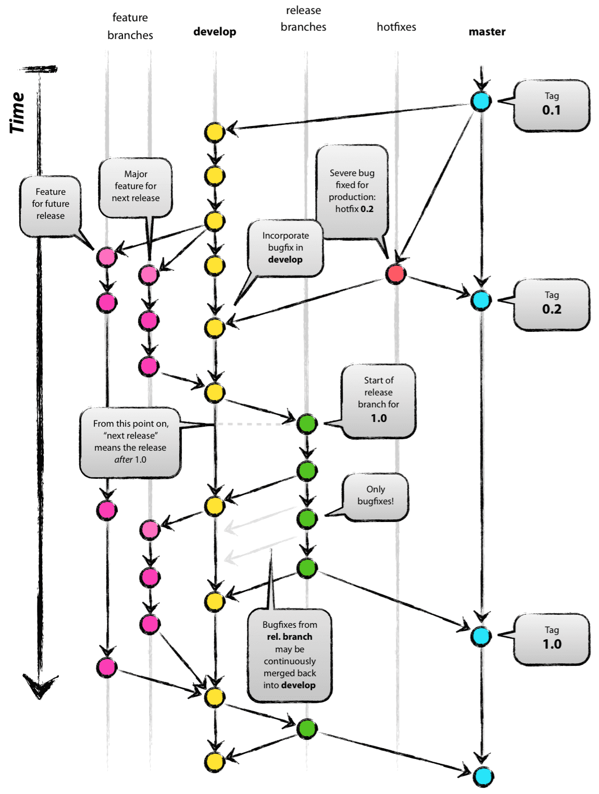
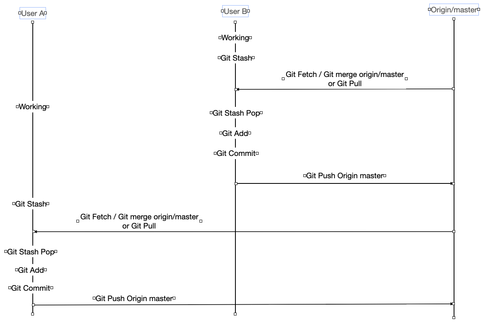

# Git Workflow 정리

## 목차

1. [Git Workflow]
2. [Workflow 관련 Git 명령어 소개]
3. [공동 작업 시 작업 Flow 소개]
4. [Conventional Commits]

---

## 1. [Git Workflow]
### Git Workflow 란?
* 2010년 Vincent Driessen이 아래 Reference에 있는 A successful Git branching model이라는 글을 기고 하면서 널리 알려진 Git으로 개발하는 방법론
* 5개의 브랜치 형태를 통해 코드를 관리하는 방법론
  * master
    * 브랜치의 시작이며 고객에게 배포하기 위한 브랜치
  * develop   
    * 개발 브랜치로 master 브랜치에서 분기되며, feature 브랜치에서 개발된 코드를 merge 하거나, 기능 개발이 완료된 코드를 반영하는 브랜치
    * 모든 기능이 개발되고, QA (품질검사) 완료 후 master 브랜치에 merge 됨
  * feature
    * 단위 기능을 개발하는 브랜치로 develop 브랜치에서 분기되며, 개발 완료 후 develop 브랜치로 merge 를 진행한다.
    * feature 브랜치는 master, develop, release-\*, hotfix-\* 를 제외한 이름으로 생성한다.
  * release
    * 배포 전 QA (품질검사) 를 하기위한 브랜치로 develop 브랜치에서 분기됨
    * QA 과정에서 나온 버그는 release 브랜치에서 수정 및 반영을 진행하며, QA 가 완료되면 master 브랜치와, develop 브랜치에 merge 를 진행한다.
    * release 브랜치는 release-* 의 규칙으로 생성한다. (ex. release-62.11) 
  * hotfix
    * master 브랜치로 배포 후 버그가 발생하였을 떄 긴급하게 수정을 진행하는 브랜치
    * hotfix 브랜치는 hotfix-* 와 같이 생성한다. (ex. hotfix-62.11)
      
</img><br/>

## 2. [Workflow 관련 Git 명령어 소개]

* git 에서 형상 관리를 진행함에 있어 유용한 키워드들을 정리하였다.
* branch
  * 브랜치를 생성하는 명령어
    ```
    git branch <<브랜치 명>>
    git push origin <<브랜치 명>>
    ```
  * 예시
    * 생성 전
    	```	 	
		<user>@MacBook-Pro:git_workflow <user>$ git branch
    	* main
     	```
    * 생성 후
      ```
      <user>@MacBook-Pro:git_workflow <user>$ git branch master
      <user>@MacBook-Pro:git_workflow <user>$ git branch
      * main
      master
      ```

* checkout
  * 브랜치를 전환하거나, 파일의 수정 사항을 복구할 때 사용하는 명령어
  * 브랜치 및 태그 전환 시
    ```
    git checkout <<브랜치 명>> or git checkout <<태그명>>
    ```
  * 파일 수정 사항 원복
    ```
    git checkout <<파일명>>
    ```
  * 예시
    * 브랜치 전환
    ```
    <user>@MacBook-Pro:git_workflow <user>$ git branch
    * main
      master
    
    <user>@MacBook-Pro:git_workflow <user>$ git checkout master
    Switched to branch 'master'
    
    <user>@MacBook-Pro:git_workflow <user>$ git branch
      main
    * master
    ```
    * 변경 사항 복구
    ```
    <user>@MacBook-Pro:git_workflow <user>$ git diff --color
    diff --git a/git_workflow.md b/git_workflow.md
    index 4dc308c..fcdb166 100644
    --- a/git_workflow.md
    +++ b/git_workflow.md
    @@ -1,3 +1,5 @@
    +checkout 테스트
    +
     # Git Workflow 정리

     ## 목차
    <user>@MacBook-Pro:git_workflow <user>$ git checkout git_workflow.md
    <user>@MacBook-Pro:git_workflow <user>$ git diff --color
    <user>@MacBook-Pro:git_workflow <user>$
    ```
* tag
  * 태그를 달기 위한 명령어
    ```
    git tag <<태그명>>
    git push origin <<태그명>>
    ```
  * 예시
    * 태깅 전
    ```
    <user>@MacBook-Pro:git_workflow <user>$ git log
    commit d39725cf99b9a111cf66cdb14a7bb15f9d7de68f (HEAD -> master, origin/master, origin/main, origin/HEAD, main)
    ```
    * 태깅 후
    ```
    <user>@MacBook-Pro:git_workflow <user>$ git tag V4.0.8
    <user>@MacBook-Pro:git_workflow <user>$ git log
    commit d39725cf99b9a111cf66cdb14a7bb15f9d7de68f (HEAD -> master, tag: V4.0.8, origin/master, origin/main, origin/HEAD, main)
    ```
* stash
  * 수정 사항을 임시 저장하는 명령어
  * git stash 로 임시 저장 -> git stash pop 으로 복구
    ```
    git stash
    git stash pop
    ```
  * 예시
    * stash 전
    ```
    <user>@MacBook-Pro:git_workflow <user>$ git stash list
    
    <user>@MacBook-Pro:git_workflow <user>$ git diff --color
    diff --git a/git_workflow.md b/git_workflow.md
    index 4dc308c..10b4789 100644
    --- a/git_workflow.md
    +++ b/git_workflow.md
    @@ -1,3 +1,5 @@
    +Stash 테스트
    +
    ```
    * stash
    ```
    <user>@MacBook-Pro:git_workflow <user>$ git stash
    Saved working directory and index state WIP on master: d39725c Add files via upload
    
    <user>@MacBook-Pro:git_workflow <user>$ git diff --color
    
    <user>@MacBook-Pro:git_workflow <user>$ git stash list
    stash@{0}: WIP on master: d39725c Add files via upload
    ```
    * stash pop
    ```
    <user>@MacBook-Pro:git_workflow <user>$ git stash pop
    On branch master
    Changes not staged for commit:
    (use "git add <file>..." to update what will be committed)
    (use "git checkout -- <file>..." to discard changes in working directory)

	    modified:   git_workflow.md

    no changes added to commit (use "git add" and/or "git commit -a")
    Dropped refs/stash@{0} (2483bd2b0a59e21a2a2850a073e97f51f7dd282b)
    
    <user>@MacBook-Pro:git_workflow <user>$ git diff --color
    diff --git a/git_workflow.md b/git_workflow.md
    index 4dc308c..10b4789 100644
    --- a/git_workflow.md
    +++ b/git_workflow.md
    @@ -1,3 +1,5 @@
    +Stash 테스트
    +
    # Git Workflow 정리
    ```
* merge
  * 다른 브랜치의 수정 사항을 병합하는 키워드
  * 병합할 브랜치로 checkout 한 후 병합 대상 브랜치로 merge 명령어 수행
    ```
    git checkout main
    git merge master (master 의 수정 사항이 main 으로 병합)
    ```
  * 예시
    * master 수정
		```
		<user>@MacBook-Pro:git_workflow <user>$ git log
		commit 1b77e35fd8a7713a97119854f8675818a9269558 (HEAD -> master, origin/master)
		Author: <user> <example@example.com>
		Date:   Wed Jul 19 22:42:37 2023 +0900

		merge 테스트 커밋

		commit by <user>
		```
		* main 브랜치 확인
		```
		<user>@MacBook-Pro:git_workflow <user>$ git log
		commit 5c32ea36efc3720339b37e038474884223497141 (HEAD -> main, origin/main, origin/HEAD)
		Author: <user> <example@example.com>
		Date:   Wed Jul 19 22:09:33 2023 +0900

		Update git_workflow.md
		```
		* merge
		```
		<user>@MacBook-Pro:git_workflow <user>$ git merge origin master
		Auto-merging git_workflow.md
		Merge made by the 'recursive' strategy.
		git_workflow.md | 1 +
		1 file changed, 1 insertion(+)
		<user>@MacBook-Pro:git_workflow <user>$ git log
		commit ceb35e2f3d90f50acf12d2575ecacdca745dbcaa (HEAD -> main)
		Merge: 5c32ea3 1b77e35
		Author: <user> <example@example.com>
		Date:   Wed Jul 19 22:45:51 2023 +0900

		Merge branch 'master' into main

		commit 1b77e35fd8a7713a97119854f8675818a9269558 (origin/master, master)
		Author: <user> <example@example.com>
		Date:   Wed Jul 19 22:42:37 2023 +0900

		merge 테스트 커밋

		commit by <user>
		```
* fetch
  * 원격 브랜치의 수정 사항을 가져오는 키워드, 가져온 수정 사항은 로컬에 반영되지 않고 임시파일에 저장된다.
  * 수정 사항 확인 후 git merge 를 통해 리모트 브랜치 수정사항을 반영하면 git pull (git fetch + merge) 과 같은 동작을 수행한다.
    ```
    git fetch
    git diff main origin/main 또는 git log --decorate --all
    git merge origin/main
    ```
  * 예시
    ```
    <user>@MacBook-Pro:git_workflow <user>$ git fetch
    remote: Enumerating objects: 5, done.
    remote: Counting objects: 100% (5/5), done.
    remote: Compressing objects: 100% (3/3), done.
    remote: Total 3 (delta 1), reused 0 (delta 0), pack-reused 0
    Unpacking objects: 100% (3/3), done.
    From https://github.com/<user>/git_workflow
    f249a24..5c32ea3  main       -> origin/main

    <user>@MacBook-Pro:git_workflow <user>$ git diff main origin/main (git log --decorate --all 로도 어떠한 커밋이 추가되었는지 확인가능)
    diff --git a/git_workflow.md b/git_workflow.md
    index 4dc308c..50ccfa6 100644
    --- a/git_workflow.md
    +++ b/git_workflow.md
    @@ -24,19 +24,137 @@
    * hotfix
     * master 브랜치로 배포 후 버그가 발생하였을 떄 긴급하게 수정을 진행하는 브랜치

    -</img><br/>
    +</img><br/

    <user>@MacBook-Pro:git_workflow <user>$ git merge origin/main
    Updating d39725c..5c32ea3
    Fast-forward
    git_workflow.md | 126 ++++++++++++++++++++++++++++++++++++++++++++++++++++++++++++++++++++++++++++++++++++++++++++++++++++++++++++++++++++++++++----
    1 file changed, 122 insertions(+), 4 deletions(-)
    
    <user>@MacBook-Pro:git_workflow <user>$ git log
    commit 5c32ea36efc3720339b37e038474884223497141 (HEAD -> main, origin/main, origin/HEAD)
    Author: <user> <example@example.com>
    Date:   Wed Jul 19 22:09:33 2023 +0900

    Update git_workflow.md

    키워드 정리
    ```
* rebase
  * merge 와 유사한 개념으로 다른 브랜치의 수정사항을 병합 할 브랜치에 최신 시점 이후로 재배치 하는 명령어
  * git rebase 로 커밋을 재배치 한 후 merge 명령어를 통해 fast-forward merge 가 가능하다.
  * 또한 커밋 로그가 하나의 흐름으로 변경되기 때문에 커밋로그 관리에 용이하다.
  * 주의 사항으로 rebase 를 통해 재배치할 때는 해시값이 변경되므로, 이미 리모트 브랜치에 Push 된 커밋에 대해 rebase 를 진행해서는 안된다.
  ```
  git checkout master
  git rebase main
  git checkout main
  git merge master
  ```
  * 예시
  ```
  <user>@MacBook-Pro:git_workflow <user>$ git log
  commit 0ca9513a6450043da8ff266bb9d8c66a3895b577
  Author: <user> <example@example.com>
  Date:   Thu Jul 20 09:43:59 2023 +0900

    rebase 테스트를 위한 커밋 2

    commit by <user>

  <user>@MacBook-Pro:git_workflow <user>$ git rebase main
  First, rewinding head to replay your work on top of it...
  Applying: rebase 테스트
  Using index info to reconstruct a base tree...
  M	git_workflow.md
  Falling back to patching base and 3-way merge...
  No changes -- Patch already applied.
  Applying: rebase 테스트를 위한 커밋 2
  <user>@MacBook-Pro:git_workflow <user>$ git log
  commit b3c39a4c9c1a8ace2c87d99d17ab00795aabb001 (HEAD -> master)
  Author: <user> <example@example.com>
  Date:   Thu Jul 20 09:43:59 2023 +0900

    rebase 테스트를 위한 커밋 2

    commit by <user>

  <user>@MacBook-Pro:git_workflow <user>$ git checkout main
  Switched to branch 'main'
  Your branch is up to date with 'origin/main'.
  <user>@MacBook-Pro:git_workflow <user>$ git merge master
  Updating 3ba5e72..b3c39a4
  Fast-forward
   git_workflow.md | 1 +
  1 file changed, 1 insertion(+)
  
  <user>@MacBook-Pro:git_workflow <user>$ git log
  commit b3c39a4c9c1a8ace2c87d99d17ab00795aabb001 (HEAD -> main, master)
  Author: <user> <example@example.com>
  Date:   Thu Jul 20 09:43:59 2023 +0900

    rebase 테스트를 위한 커밋 2

    commit by <user>
  ```
* revert
  * 반영된 코드를 이전으로 원복 시키는 키워드
  ```
  git revert <<커밋 해시>>
  ```
  * 예시
	  ```
	  <user>@MacBook-Pro:git_workflow <user>$ git show 1b77e35fd8a7713a97119854f8675818a9269558
	  commit 1b77e35fd8a7713a97119854f8675818a9269558 (origin/master, master)
	  Author: <user> <example@example.com>
	  Date:   Wed Jul 19 22:42:37 2023 +0900

	    merge 테스트 커밋
	
	    commit by <user>
	
	  diff --git a/git_workflow.md b/git_workflow.md
	  index 4dc308c..ec0788a 100644
	  --- a/git_workflow.md
	  +++ b/git_workflow.md
	  @@ -1,3 +1,4 @@
	  +merge 테스트 - master 브랜치 수정 사항
	
	  <user>@MacBook-Pro:git_workflow <user>$ git revert 1b77e35fd8a7713a97119854f8675818a9269558
	  [main 6f9990f] Revert "merge 테스트 커밋"
	  1 file changed, 1 deletion(-)
	 
	  <user>@MacBook-Pro:git_workflow <user>$ git show 6f9990f009e52824e21bdea5c41a99a58ef3f55b
	  commit 6f9990f009e52824e21bdea5c41a99a58ef3f55b
	  Author: <user> <example@example.com>
	  Date:   Wed Jul 19 23:31:20 2023 +0900
	
	    Revert "merge 테스트 커밋"
	
	    This reverts commit 1b77e35fd8a7713a97119854f8675818a9269558.
	
	  diff --git a/git_workflow.md b/git_workflow.md
	  index 2adb7c9..50ccfa6 100644
	  --- a/git_workflow.md
	  +++ b/git_workflow.md
	  @@ -1,4 +1,3 @@
	  -merge 테스트 - master 브랜치 수정 사항
	  # Git Workflow 정리
	  ```

* cherry-pick
  * 다른 브랜치의 특정 커밋만 선택하여 현재 브랜치에 적용하는 명령어
  * merge 와 달리 브랜치 전체가 아닌 원하는 커밋 하나만 가져올 수 있다.
    ```
    git cherry-pick <<커밋 해시>>
    ```
  * 예시
    * feature 브랜치에서 특정 커밋만 main 에 반영
    ```
    <user>@MacBook-Pro:git_workflow <user>$ git log feature --oneline
    a1b2c3d hotfix: 결제 버그 수정
    e4f5g6h feat: 신규 로그인 기능 추가
    i7j8k9l feat: 마이페이지 UI 개선

    <user>@MacBook-Pro:git_workflow <user>$ git checkout main
    Switched to branch 'main'

    <user>@MacBook-Pro:git_workflow <user>$ git cherry-pick a1b2c3d
    [main 9z8y7x6] hotfix: 결제 버그 수정
     1 file changed, 3 insertions(+), 1 deletion(-)

    <user>@MacBook-Pro:git_workflow <user>$ git log --oneline
    9z8y7x6 (HEAD -> main) hotfix: 결제 버그 수정
    5c32ea3 (origin/main) Update git_workflow.md
    ```

* bisect
  * 버그가 발생한 커밋을 이진 탐색으로 찾아내는 명령어
  * 버그가 없는 커밋(good)과 버그가 있는 커밋(bad)을 지정하면, Git 이 자동으로 중간 커밋을 체크아웃하며 범위를 좁혀준다.
    ```
    git bisect start
    git bisect bad                    (현재 커밋이 버그 있음)
    git bisect good <<커밋 해시>>     (버그가 없었던 커밋 지정)
    git bisect reset                  (탐색 종료 후 원래 브랜치로 복귀)
    ```
  * 예시
    ```
    <user>@MacBook-Pro:git_workflow <user>$ git bisect start
    <user>@MacBook-Pro:git_workflow <user>$ git bisect bad
    <user>@MacBook-Pro:git_workflow <user>$ git bisect good d39725c
    Bisecting: 3 revisions left to test after this (roughly 2 steps)
    [b3c39a4] rebase 테스트를 위한 커밋 2

    (버그 확인 후)
    <user>@MacBook-Pro:git_workflow <user>$ git bisect bad
    Bisecting: 1 revision left to test after this (roughly 1 step)
    [1b77e35] merge 테스트 커밋

    <user>@MacBook-Pro:git_workflow <user>$ git bisect good
    b3c39a4 is the first bad commit
    commit b3c39a4c9c1a8ace2c87d99d17ab00795aabb001
    Author: <user> <example@example.com>
    Date:   Thu Jul 20 09:43:59 2023 +0900

      rebase 테스트를 위한 커밋 2

    <user>@MacBook-Pro:git_workflow <user>$ git bisect reset
    Previous HEAD position was 1b77e35 merge 테스트 커밋
    Switched to branch 'main'
    ```

* rebase -i (interactive rebase)
  * 커밋 히스토리를 대화형으로 수정하는 명령어
  * 커밋 squash (여러 커밋을 하나로 합치기), 커밋 메시지 수정, 커밋 순서 변경 등이 가능하다.
  * 주의 사항으로 이미 리모트에 push 된 커밋에 대해 사용하면 히스토리가 달라져 충돌이 발생한다.
    ```
    git rebase -i HEAD~<<합칠 커밋 수>>
    ```
  * 예시
    * 최근 3개의 커밋을 하나로 squash
    ```
    <user>@MacBook-Pro:git_workflow <user>$ git log --oneline
    a1b2c3d (HEAD -> feature) feat: 버튼 색상 변경
    b4c5d6e feat: 버튼 위치 조정
    c7d8e9f feat: 버튼 추가
    5c32ea3 (origin/main) Update git_workflow.md

    <user>@MacBook-Pro:git_workflow <user>$ git rebase -i HEAD~3

    (편집기에서 pick → squash 로 변경)
    pick c7d8e9f feat: 버튼 추가
    squash b4c5d6e feat: 버튼 위치 조정
    squash a1b2c3d feat: 버튼 색상 변경

    (커밋 메시지 편집 후 저장)
    [detached HEAD f1e2d3c] feat: 버튼 추가 및 스타일 적용
     3 files changed, 12 insertions(+), 2 deletions(-)

    <user>@MacBook-Pro:git_workflow <user>$ git log --oneline
    f1e2d3c (HEAD -> feature) feat: 버튼 추가 및 스타일 적용
    5c32ea3 (origin/main) Update git_workflow.md
    ```

## 3. [공동 작업 시 작업 Flow 소개]

  * 하나의 브랜치에서 여러명이 작업할 때 아래의 flow 를 통해 작업을 진행한다.

    </img><br/>

  * workflow 는 아래와 같다.
    1. 각 로컬 브랜치에서 작업 진행
    2. 사용자 B 기준으로 git stash 를 통해 현재 작업 내용을 임시 저장하고, git fetch + git merge 또는 git pull 을 통해 리모트 브랜치에서 최신코드를 반영
    3. git stash pop 을 통해 작업 내용을 복구
    4. 3번 과정에서 conflict 발생 시 conflict 사항을 수정
    5. git add -> git commit -> git push 를 통해 코드 반영
    6. 사용자 A 기준으로 2~5번까지의 동작을 반복 수행

* 레퍼런스
  * https://nvie.com/posts/a-successful-git-branching-model/
  * https://gmlwjd9405.github.io/2018/05/11/types-of-git-branch.html
  * https://ansohxxn.github.io/git/merge/

---

## 4. [Conventional Commits]

### Conventional Commits 란?
* 커밋 메시지를 일관된 형식으로 작성하기 위한 컨벤션
* 팀원 간 커밋 히스토리의 가독성을 높이고, 자동화 도구(CHANGELOG 생성, 버전 태깅 등)와 연동이 가능하다.
* https://www.conventionalcommits.org/

### 커밋 메시지 형식
```
<type>[optional scope]: <description>

[optional body]

[optional footer(s)]
```

### type 종류
| type | 설명 |
|------|------|
| feat | 새로운 기능 추가 |
| fix | 버그 수정 |
| docs | 문서 수정 (README 등) |
| style | 코드 포맷, 세미콜론 누락 등 동작에 영향 없는 변경 |
| refactor | 기능 변경 없이 코드 구조 개선 |
| test | 테스트 코드 추가 또는 수정 |
| chore | 빌드 설정, 패키지 업데이트 등 기타 변경 |

### 예시
* 기본 커밋
  ```
  git commit -m "feat: 로그인 기능 추가"
  git commit -m "fix: 결제 금액 계산 오류 수정"
  git commit -m "docs: README 설치 가이드 업데이트"
  ```
* scope 포함 (변경 범위를 괄호로 명시)
  ```
  git commit -m "feat(auth): OAuth 소셜 로그인 추가"
  git commit -m "fix(payment): 카드 결제 실패 시 에러 메시지 수정"
  ```
* body 포함 (상세 설명이 필요한 경우)
  ```
  git commit -m "refactor(user): 회원가입 로직 분리

  기존 컨트롤러에 집중된 회원가입 로직을 서비스 레이어로 분리.
  단위 테스트 작성이 용이해짐."
  ```
* BREAKING CHANGE (하위 호환성이 깨지는 변경)
  ```
  git commit -m "feat!: API 응답 형식 변경

  BREAKING CHANGE: /users 엔드포인트 응답 구조가 변경됨.
  기존: { data: [...] }
  변경: { users: [...], total: N }"
  ```

### 실제 커밋 히스토리 예시
```
<user>@MacBook-Pro:git_workflow <user>$ git log --oneline
f1e2d3c (HEAD -> main) fix(auth): 토큰 만료 시 자동 갱신 오류 수정
a2b3c4d feat(mypage): 프로필 이미지 업로드 기능 추가
b5c6d7e docs: API 명세 업데이트
c8d9e0f refactor: 공통 유틸 함수 모듈화
d1e2f3g feat(payment): 카카오페이 결제 연동
```
