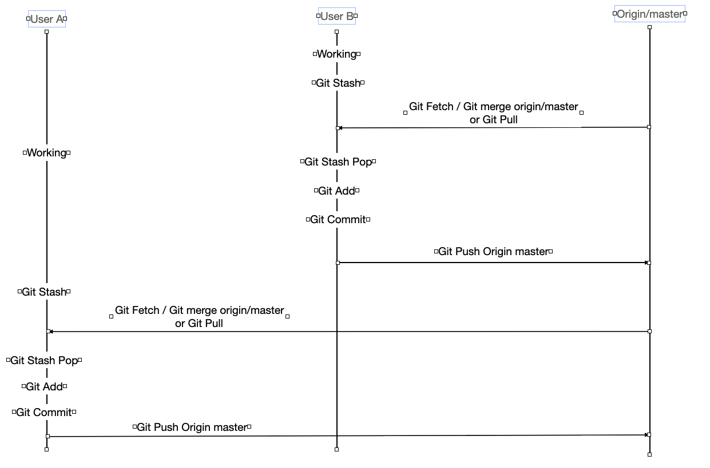

# Git Workflow 정리

## 목차

1. [Git Workflow]
2. [Workflow 관련 Git 명령어 소개]
3. [공동 작업 시 작업 Flow 소개]

---

## 1. [Git Workflow]
### Git Workflow 란?
* 2010년 Vincent Driessen이 아래 Reference에 있는 A successful Git branching model이라는 글을 기고 하면서 널리 알려진 Git으로 개발하는 방법론
* 5개의 브랜치 형태를 통해 코드를 관리하는 방법론
  * master
    * 브랜치의 시작이며 고객에게 배포하기 위한 브랜치
  * develop   
    * 개발 브랜치로 master 브랜치에서 분기되며, feature 브랜치에서 개발된 코드를 merge 하거나, 기능 개발이 완료된 코드를 반영하는 브랜치
    * 모든 기능이 개발되고, QA (품질검사) 완료 후 master 브랜치에 merge 됨
  * feature
    * 단위 기능을 개발하는 브랜치로 develop 브랜치에서 분기되며, 개발 완료 후 develop 브랜치로 merge 를 진행한다.
    * feature 브랜치는 master, develop, release-\*, hotfix-\* 를 제외한 이름으로 생성한다.
  * release
    * 배포 전 QA (품질검사) 를 하기위한 브랜치로 develop 브랜치에서 분기됨
    * QA 과정에서 나온 버그는 release 브랜치에서 수정 및 반영을 진행하며, QA 가 완료되면 master 브랜치와, develop 브랜치에 merge 를 진행한다.
    * release 브랜치는 release-* 의 규칙으로 생성한다. (ex. release-62.11) 
  * hotfix
    * master 브랜치로 배포 후 버그가 발생하였을 떄 긴급하게 수정을 진행하는 브랜치
    * hotfix 브랜치는 hotfix-* 와 같이 생성한다. (ex. hotfix-62.11)
      
</img><br/>

## 2. [Workflow 관련 Git 명령어 소개]

* git 에서 형상 관리를 진행함에 있어 유용한 키워드들을 정리하였다.
* branch
  * 브랜치를 생성하는 명령어
    ```
    git branch <<브랜치 명>>
    git push origin <<브랜치 명>>
    ```
  * 예시
    * 생성 전
    	```	 	
		SeonilKimui-MacBook-Pro-2:git_workflow seonil$ git branch
    	* main
     	```
    * 생성 후
      ```
      SeonilKimui-MacBook-Pro-2:git_workflow seonil$ git branch master
      SeonilKimui-MacBook-Pro-2:git_workflow seonil$ git branch
      * main
      master
      ```

* checkout
  * 브랜치를 전환하거나, 파일의 수정 사항을 복구할 때 사용하는 명령어
  * 브랜치 및 태그 전환 시
    ```
    git checkout <<브랜치 명>> or git checkout <<태그명>>
    ```
  * 파일 수정 사항 원복
    ```
    git checkout <<파일명>>
    ```
  * 예시
    * 브랜치 전환
    ```
    SeonilKimui-MacBook-Pro-2:git_workflow seonil$ git branch
    * main
      master
    
    SeonilKimui-MacBook-Pro-2:git_workflow seonil$ git checkout master
    Switched to branch 'master'
    
    SeonilKimui-MacBook-Pro-2:git_workflow seonil$ git branch
      main
    * master
    ```
    * 변경 사항 복구
    ```
    SeonilKimui-MacBook-Pro-2:git_workflow seonil$ git diff --color
    diff --git a/git_workflow.md b/git_workflow.md
    index 4dc308c..fcdb166 100644
    --- a/git_workflow.md
    +++ b/git_workflow.md
    @@ -1,3 +1,5 @@
    +checkout 테스트
    +
     # Git Workflow 정리

     ## 목차
    SeonilKimui-MacBook-Pro-2:git_workflow seonil$ git checkout git_workflow.md
    SeonilKimui-MacBook-Pro-2:git_workflow seonil$ git diff --color
    SeonilKimui-MacBook-Pro-2:git_workflow seonil$
    ```
* tag
  * 태그를 달기 위한 명령어
    ```
    git tag <<태그명>>
    git push origin <<태그명>>
    ```
  * 예시
    * 태깅 전
    ```
    SeonilKimui-MacBook-Pro-2:git_workflow seonil$ git log
    commit d39725cf99b9a111cf66cdb14a7bb15f9d7de68f (HEAD -> master, origin/master, origin/main, origin/HEAD, main)
    ```
    * 태깅 후
    ```
    SeonilKimui-MacBook-Pro-2:git_workflow seonil$ git tag V4.0.8
    SeonilKimui-MacBook-Pro-2:git_workflow seonil$ git log
    commit d39725cf99b9a111cf66cdb14a7bb15f9d7de68f (HEAD -> master, tag: V4.0.8, origin/master, origin/main, origin/HEAD, main)
    ```
* stash
  * 수정 사항을 임시 저장하는 명령어
  * git stash 로 임시 저장 -> git stash pop 으로 복구
    ```
    git stash
    git stash pop
    ```
  * 예시
    * stash 전
    ```
    SeonilKimui-MacBook-Pro-2:git_workflow seonil$ git stash list
    
    SeonilKimui-MacBook-Pro-2:git_workflow seonil$ git diff --color
    diff --git a/git_workflow.md b/git_workflow.md
    index 4dc308c..10b4789 100644
    --- a/git_workflow.md
    +++ b/git_workflow.md
    @@ -1,3 +1,5 @@
    +Stash 테스트
    +
    ```
    * stash
    ```
    SeonilKimui-MacBook-Pro-2:git_workflow seonil$ git stash
    Saved working directory and index state WIP on master: d39725c Add files via upload
    
    SeonilKimui-MacBook-Pro-2:git_workflow seonil$ git diff --color
    
    SeonilKimui-MacBook-Pro-2:git_workflow seonil$ git stash list
    stash@{0}: WIP on master: d39725c Add files via upload
    ```
    * stash pop
    ```
    SeonilKimui-MacBook-Pro-2:git_workflow seonil$ git stash pop
    On branch master
    Changes not staged for commit:
    (use "git add <file>..." to update what will be committed)
    (use "git checkout -- <file>..." to discard changes in working directory)

	    modified:   git_workflow.md

    no changes added to commit (use "git add" and/or "git commit -a")
    Dropped refs/stash@{0} (2483bd2b0a59e21a2a2850a073e97f51f7dd282b)
    
    SeonilKimui-MacBook-Pro-2:git_workflow seonil$ git diff --color
    diff --git a/git_workflow.md b/git_workflow.md
    index 4dc308c..10b4789 100644
    --- a/git_workflow.md
    +++ b/git_workflow.md
    @@ -1,3 +1,5 @@
    +Stash 테스트
    +
    # Git Workflow 정리
    ```
* merge
  * 다른 브랜치의 수정 사항을 병합하는 키워드
  * 병합할 브랜치로 checkout 한 후 병합 대상 브랜치로 merge 명령어 수행
    ```
    git checkout main
    git merge master (master 의 수정 사항이 main 으로 병합)
    ```
  * 예시
    * master 수정
		```
		SeonilKimui-MacBook-Pro-2:git_workflow seonil$ git log
		commit 1b77e35fd8a7713a97119854f8675818a9269558 (HEAD -> master, origin/master)
		Author: 김선일 <si.kim@piolink.com>
		Date:   Wed Jul 19 22:42:37 2023 +0900

		merge 테스트 커밋

		commit by si.kim
		```
		* main 브랜치 확인
		```
		SeonilKimui-MacBook-Pro-2:git_workflow seonil$ git log
		commit 5c32ea36efc3720339b37e038474884223497141 (HEAD -> main, origin/main, origin/HEAD)
		Author: Seonil9036 <seonil9036@gmail.com>
		Date:   Wed Jul 19 22:09:33 2023 +0900

		Update git_workflow.md
		```
		* merge
		```
		SeonilKimui-MacBook-Pro-2:git_workflow seonil$ git merge origin master
		Auto-merging git_workflow.md
		Merge made by the 'recursive' strategy.
		git_workflow.md | 1 +
		1 file changed, 1 insertion(+)
		SeonilKimui-MacBook-Pro-2:git_workflow seonil$ git log
		commit ceb35e2f3d90f50acf12d2575ecacdca745dbcaa (HEAD -> main)
		Merge: 5c32ea3 1b77e35
		Author: 김선일 <si.kim@piolink.com>
		Date:   Wed Jul 19 22:45:51 2023 +0900

		Merge branch 'master' into main

		commit 1b77e35fd8a7713a97119854f8675818a9269558 (origin/master, master)
		Author: 김선일 <si.kim@piolink.com>
		Date:   Wed Jul 19 22:42:37 2023 +0900

		merge 테스트 커밋

		commit by si.kim
		```
* fetch
  * 원격 브랜치의 수정 사항을 가져오는 키워드, 가져온 수정 사항은 로컬에 반영되지 않고 임시파일에 저장된다.
  * 수정 사항 확인 후 git merge 를 통해 리모트 브랜치 수정사항을 반영하면 git pull (git fetch + merge) 과 같은 동작을 수행한다.
    ```
    git fetch
    git diff main origin/main 또는 git log --decorate --all
    git merge origin/main
    ```
  * 예시
    ```
    SeonilKimui-MacBook-Pro-2:git_workflow seonil$ git fetch
    remote: Enumerating objects: 5, done.
    remote: Counting objects: 100% (5/5), done.
    remote: Compressing objects: 100% (3/3), done.
    remote: Total 3 (delta 1), reused 0 (delta 0), pack-reused 0
    Unpacking objects: 100% (3/3), done.
    From https://github.com/Seonil9036/git_workflow
    f249a24..5c32ea3  main       -> origin/main

    SeonilKimui-MacBook-Pro-2:git_workflow seonil$ git diff main origin/main (git log --decorate --all 로도 어떠한 커밋이 추가되었는지 확인가능)
    diff --git a/git_workflow.md b/git_workflow.md
    index 4dc308c..50ccfa6 100644
    --- a/git_workflow.md
    +++ b/git_workflow.md
    @@ -24,19 +24,137 @@
    * hotfix
     * master 브랜치로 배포 후 버그가 발생하였을 떄 긴급하게 수정을 진행하는 브랜치

    -</img><br/>
    +</img><br/

    SeonilKimui-MacBook-Pro-2:git_workflow seonil$ git merge origin/main
    Updating d39725c..5c32ea3
    Fast-forward
    git_workflow.md | 126 ++++++++++++++++++++++++++++++++++++++++++++++++++++++++++++++++++++++++++++++++++++++++++++++++++++++++++++++++++++++++++----
    1 file changed, 122 insertions(+), 4 deletions(-)
    
    SeonilKimui-MacBook-Pro-2:git_workflow seonil$ git log
    commit 5c32ea36efc3720339b37e038474884223497141 (HEAD -> main, origin/main, origin/HEAD)
    Author: Seonil9036 <seonil9036@gmail.com>
    Date:   Wed Jul 19 22:09:33 2023 +0900

    Update git_workflow.md

    키워드 정리
    ```
* rebase
  * merge 와 유사한 개념으로 다른 브랜치의 수정사항을 병합 할 브랜치에 최신 시점 이후로 재배치 하는 명령어
  * git rebase 로 커밋을 재배치 한 후 merge 명령어를 통해 fast-forward merge 가 가능하다.
  * 또한 커밋 로그가 하나의 흐름으로 변경되기 때문에 커밋로그 관리에 용이하다.
  * 주의 사항으로 rebase 를 통해 재배치할 때는 해시값이 변경되므로, 이미 리모트 브랜치에 Push 된 커밋에 대해 rebase 를 진행해서는 안된다.
  ```
  git checkout master
  git rebase main
  git checkout main
  git merge master
  ```
  * 예시
  ```
  SeonilKimui-MacBook-Pro-2:git_workflow seonil$ git log
  commit 0ca9513a6450043da8ff266bb9d8c66a3895b577
  Author: Seonil9036 <seonil9036@gmail.com>
  Date:   Thu Jul 20 09:43:59 2023 +0900

    rebase 테스트를 위한 커밋 2

    commit by sikim

  SeonilKimui-MacBook-Pro-2:git_workflow seonil$ git rebase main
  First, rewinding head to replay your work on top of it...
  Applying: rebase 테스트
  Using index info to reconstruct a base tree...
  M	git_workflow.md
  Falling back to patching base and 3-way merge...
  No changes -- Patch already applied.
  Applying: rebase 테스트를 위한 커밋 2
  SeonilKimui-MacBook-Pro-2:git_workflow seonil$ git log
  commit b3c39a4c9c1a8ace2c87d99d17ab00795aabb001 (HEAD -> master)
  Author: Seonil9036 <seonil9036@gmail.com>
  Date:   Thu Jul 20 09:43:59 2023 +0900

    rebase 테스트를 위한 커밋 2

    commit by sikim

  SeonilKimui-MacBook-Pro-2:git_workflow seonil$ git checkout main
  Switched to branch 'main'
  Your branch is up to date with 'origin/main'.
  SeonilKimui-MacBook-Pro-2:git_workflow seonil$ git merge master
  Updating 3ba5e72..b3c39a4
  Fast-forward
   git_workflow.md | 1 +
  1 file changed, 1 insertion(+)
  
  SeonilKimui-MacBook-Pro-2:git_workflow seonil$ git log
  commit b3c39a4c9c1a8ace2c87d99d17ab00795aabb001 (HEAD -> main, master)
  Author: Seonil9036 <seonil9036@gmail.com>
  Date:   Thu Jul 20 09:43:59 2023 +0900

    rebase 테스트를 위한 커밋 2

    commit by sikim
  ```
* revert
  * 반영된 코드를 이전으로 원복 시키는 키워드
  ```
  git revert <<커밋 해시>>
  ```
  * 예시
	  ```
	  SeonilKimui-MacBook-Pro-2:git_workflow seonil$ git show 1b77e35fd8a7713a97119854f8675818a9269558
	  commit 1b77e35fd8a7713a97119854f8675818a9269558 (origin/master, master)
	  Author: 김선일 <si.kim@piolink.com>
	  Date:   Wed Jul 19 22:42:37 2023 +0900
	  1 [user]
	
	    merge 테스트 커밋
	
	    commit by si.kim
	
	  diff --git a/git_workflow.md b/git_workflow.md
	  index 4dc308c..ec0788a 100644
	  --- a/git_workflow.md
	  +++ b/git_workflow.md
	  @@ -1,3 +1,4 @@
	  +merge 테스트 - master 브랜치 수정 사항
	
	  SeonilKimui-MacBook-Pro-2:git_workflow seonil$ git revert 1b77e35fd8a7713a97119854f8675818a9269558
	  [main 6f9990f] Revert "merge 테스트 커밋"
	  1 file changed, 1 deletion(-)
	 
	  SeonilKimui-MacBook-Pro-2:git_workflow seonil$ git show 6f9990f009e52824e21bdea5c41a99a58ef3f55b
	  commit 6f9990f009e52824e21bdea5c41a99a58ef3f55b
	  Author: 김선일 <si.kim@piolink.com>
	  Date:   Wed Jul 19 23:31:20 2023 +0900
	
	    Revert "merge 테스트 커밋"
	
	    This reverts commit 1b77e35fd8a7713a97119854f8675818a9269558.
	
	  diff --git a/git_workflow.md b/git_workflow.md
	  index 2adb7c9..50ccfa6 100644
	  --- a/git_workflow.md
	  +++ b/git_workflow.md
	  @@ -1,4 +1,3 @@
	  -merge 테스트 - master 브랜치 수정 사항
	  # Git Workflow 정리
	  ```

## 3. [공동 작업 시 작업 Flow 소개]

  * 하나의 브랜치에서 여러명이 작업할 때 아래의 flow 를 통해 작업을 진행한다.

    </img><br/>

  * workflow 는 아래와 같다.
    1. 각 로컬 브랜치에서 작업 진행
    2. 사용자 B 기준으로 git stash 를 통해 현재 작업 내용을 임시 저장하고, git fetch + git merge 또는 git pull 을 통해 리모트 브랜치에서 최신코드를 반영
    3. git stash pop 을 통해 작업 내용을 복구
    4. 3번 과정에서 conflict 발생 시 conflict 사항을 수정
    5. git add -> git commit -> git push 를 통해 코드 반영
    6. 사용자 A 기준으로 2~5번까지의 동작을 반복 수행

* 레퍼런스
  * https://nvie.com/posts/a-successful-git-branching-model/
  * https://gmlwjd9405.github.io/2018/05/11/types-of-git-branch.html
  * https://ansohxxn.github.io/git/merge/
